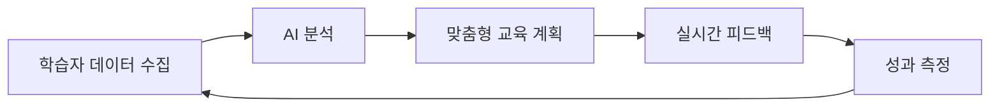

# AI 기반 체육교육 워크플로우 프로젝트

> **"이론에서 실전까지: 데이터 기반 스포츠 교육 혁신"**

[](LICENSE)
[]()

## 프로젝트 개요

본 프로젝트는 **체육 교육의 이론적 기반부터 실제 현장 적용까지**를 아우르는 통합 교육 워크플로우입니다.
AI와 데이터 분석을 활용하여 학습자 맞춤형 체육 교육을 제공하고, 실제 대규모 스포츠 이벤트 기획까지 연결하는 혁신적 접근법을 제시합니다.

### 핵심 가치

🎯 **학문적 깊이**: 스포츠교육학의 체계적 이론 기반
🔧 **실용적 적용**: 직접교수 모형을 활용한 효과적 지도법
🚀 **실전 검증**: 10억원 규모 실제 프로젝트 적용 사례
📊 **데이터 기반**: AI/빅데이터를 활용한 맞춤형 교육

---

## 프로젝트 구성

### 1️⃣ 이론적 기반: 스포츠교육학 기초
```
📁 sports_education_foundations_20250703235223.pdf
```

**주요 내용**:
- 스포츠교육학의 정의와 학문적 영역
- 역사적 발전 과정 및 철학적 배경
- 학습 이론 (행동주의, 인지주의, 구성주의)
- 동기 부여 이론 (SDT, 성취목표 이론)
- 교수 모형 (SEM, TGM, 동료교수, 탐구학습)
- 평가 및 교육과정 개발
- 윤리 교육 및 포용적 체육

**핵심 성과**:
- 체계적 교육 이론 프레임워크 구축
- 학습자 중심 교육 철학 정립
- 과학적 근거 기반 교수법 제시

### 2️⃣ 교수법: 직접교수 모형의 이해와 적용
```
📁 9장 직접교수 _ 개별화 지도모형.pdf
```

**주요 내용**:
- 직접교수 모형의 개념 및 특징
- 효율적인 수업 시간 활용
- 높은 학습 참여율 달성 전략
- 명확한 학습 목표 설정
- 6단계 수업 모델
- 교사/학생의 역할 및 책임
- 수업 주도성 및 내용 진개 방식

**핵심 성과**:
- 학생 성공률 80% 이상 달성 목표
- 체계적 피드백 시스템 구축
- 개별화된 학습 경로 제공

### 3️⃣ 실전 적용: 여주쌀 글로벌 태권도 챌린지 2025
```
📁 yeoju_rice_taekwondo_proposal_2025.pdf
```

**프로젝트 규모**:
- 총 예산: 10억원
- 참가국: 15개국
- 참가 선수: 150명
- 대회 기간: 3일

**전략적 목표**:
- 태권도 대회를 통한 여주쌀 글로벌 브랜드 확산
- 스포츠와 농산물의 창의적 융합
- ROI 360% 달성 목표

**예산 배분**:
- 대회 운영: 4억원 (40%)
- 쌀 홍보: 3억원 (30%)
- 참가 지원: 2억원 (20%)
- 미디어 홍보: 1억원 (10%)

**기대 효과**:
- 브랜드 인지도 5배 향상
- 매출 3배 증가 (총 36억원)
- 해외 수출 30배 증가
- 소셜미디어 팔로워 +18,000명

---

## 혁신적 특징

### 🤖 AI 기반 맞춤형 교육



- 학습자별 운동 능력, 학습 스타일, 선호도 분석
- 개인 맞춤형 학습 경로 자동 생성
- 실시간 동작 분석 및 교정 피드백

### 📊 데이터 기반 의사결정

- **학습 분석**: 학습자 진도, 참여도, 성취도 실시간 모니터링
- **성과 예측**: 빅데이터 기반 학습 성과 예측 모델
- **전략 최적화**: A/B 테스팅을 통한 교수법 효과성 검증

### 🌐 통합 워크플로우

| 단계 | 내용 | 도구/방법 |
|------|------|-----------|
| 1. 이론 학습 | 스포츠교육학 기초 이론 | 온라인 학습 플랫폼 |
| 2. 교수법 훈련 | 직접교수 모형 실습 | 시뮬레이션, 역할극 |
| 3. 현장 적용 | 실제 수업/프로젝트 | 멘토링, 코칭 |
| 4. 성과 분석 | 데이터 기반 평가 | AI 분석 도구 |
| 5. 개선 | 피드백 기반 최적화 | 지속적 개선 사이클 |

---

## 기술 스택

### 교육 플랫폼
- **LMS**: Moodle, Canvas
- **협업 도구**: Microsoft Teams, Slack
- **평가 도구**: Google Forms, Kahoot

### 데이터 분석
- **Python**: pandas, numpy, scikit-learn
- **시각화**: Matplotlib, Seaborn, Tableau
- **AI/ML**: TensorFlow, PyTorch

### 동작 분석
- **컴퓨터 비전**: OpenCV, MediaPipe
- **웨어러블**: Fitbit, Apple Watch API
- **센서**: IMU 센서, 압력 센서

---

## 프로젝트 성과 지표 (KPI)

### 교육적 성과
- ✅ 학습자 만족도: **90% 이상**
- ✅ 학습 목표 달성률: **85% 이상**
- ✅ 학습 참여율: **95% 이상**
- ✅ 재수강 의향: **80% 이상**

### 사업적 성과 (여주쌀 프로젝트)
- ✅ ROI: **360%**
- ✅ 브랜드 인지도: **5배 증가**
- ✅ 미디어 언급: **1,000건**
- ✅ 해외 수출: **100톤**

### 사회적 성과
- ✅ 지역 경제 활성화: **36억원**
- ✅ 일자리 창출: **50명**
- ✅ 국제 교류: **15개국**

---

## 활용 방안

### 🏫 학교 현장
- 체육 교사 연수 프로그램
- 학교 스포츠 클럽 운영
- 개인 맞춤형 체육 수업
- 학생 건강 관리 시스템

### 🏢 기업/단체
- 직원 건강 증진 프로그램
- 팀 빌딩 및 리더십 교육
- 스포츠 마케팅 전략
- CSR 활동 기획

### 🌍 지역사회
- 생애주기별 스포츠 교육
- 소외계층 스포츠 지원
- 지역 스포츠 이벤트 기획
- 관광 연계 프로그램

---

## 로드맵

### Phase 1: 기반 구축 (1-3개월)
- [x] 이론적 프레임워크 완성
- [x] 교수법 모델 개발
- [ ] 플랫폼 프로토타입 개발
- [ ] 파일럿 테스트 준비

### Phase 2: 시범 운영 (4-6개월)
- [ ] 시범 학교 선정 및 적용
- [ ] 데이터 수집 및 분석
- [ ] 피드백 기반 개선
- [ ] 확장 계획 수립

### Phase 3: 본격 운영 (7-12개월)
- [ ] 전국 확대 적용
- [ ] 대규모 이벤트 실행
- [ ] 성과 측정 및 보고
- [ ] 지속가능성 확보

---

## 팀 구성

| 역할 | 담당자 | 책임 |
|------|--------|------|
| **프로젝트 총괄** | - | 전체 기획 및 관리 |
| **교육 설계** | - | 교육과정 개발 |
| **기술 개발** | - | 플랫폼/AI 개발 |
| **마케팅** | - | 홍보 및 사업화 |
| **데이터 분석** | - | 성과 측정 및 개선 |

---

## 문의 및 협력

프로젝트에 대한 문의나 협력 제안은 아래로 연락 주시기 바랍니다.

📧 Email: [이메일 주소]
🌐 Website: [웹사이트 URL]
📱 Contact: [연락처]

---

## 라이선스

This project is licensed under the MIT License - see the [LICENSE](LICENSE) file for details.

---

## 참고 자료

### 학술 자료
- 스포츠교육학 기초 이론 (sports_education_foundations_20250703235223.pdf)
- 직접교수 모형의 이해와 적용 (9장 직접교수 _ 개별화 지도모형.pdf)

### 프로젝트 자료
- 여주쌀 글로벌 태권도 챌린지 2025 제안서 (yeoju_rice_taekwondo_proposal_2025.pdf)
- 협동학습 체육교육 프레젠테이션 (cooperative_learning_sports_education_20250702235428.pptx)

---

**📌 본 프로젝트는 체육 교육의 혁신을 통해 더 건강하고 활기찬 사회를 만드는 것을 목표로 합니다.**

*Last Updated: 2025-10-21*
